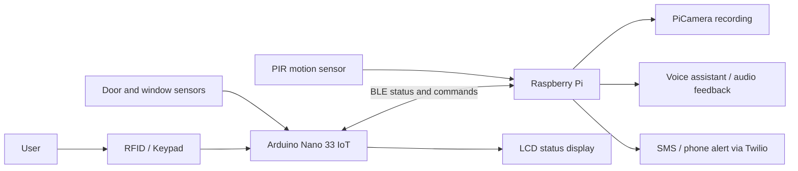

# Home Security System

Embedded security prototype using Arduino Nano 33 IoT, Raspberry Pi, BLE, RFID, keypad input, LCD feedback, door/window sensors, PIR motion detection, camera recording, and alert logic.

## Overview

This project was built as a practical IoT security system prototype. An Arduino handles local access-control inputs such as RFID, keypad, door/window sensors, and LCD status display. A Raspberry Pi communicates with the Arduino over BLE, monitors motion, manages video recording, and coordinates higher-level security responses.

## Tech Stack

- Arduino Nano 33 IoT
- Raspberry Pi
- Python
- Arduino C++
- BLE
- RFID, keypad, LCD, PIR sensor, door/window sensors
- PiCamera, GPIO

## Architecture

## Key Features

- RFID-based access control
- Keypad password entry
- Door and window status monitoring
- PIR motion detection
- BLE communication between Arduino and Raspberry Pi
- Camera recording and MP4 conversion
- Audio feedback and alert workflow

## My Contribution

- Designed the hardware/software interaction between Arduino and Raspberry Pi
- Implemented BLE notification and command exchange
- Integrated multiple sensors into one security workflow
- Built Raspberry Pi logic for monitoring, recording, and response handling

## What This Demonstrates

- Embedded systems integration
- Hardware troubleshooting
- Python automation on Raspberry Pi
- BLE communication
- Practical engineering problem solving

## Notes

This is a university project prototype. For production use, credentials and device-specific identifiers should be moved into environment variables or a secure configuration store.
